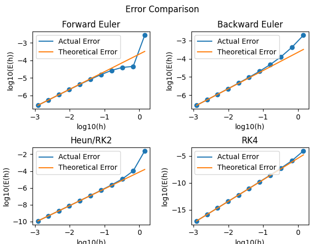
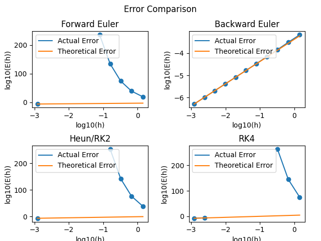

# ode-solvers
## Instructions
To make use of this code, clone the repo and in the `/build` folder you can find all of the plot scripts. Only `plot_error_stiff.py` and `plot_error_exp.py` are not really suited for editing or general use. Both `plot_methods.py` and `plot_second_order.py` can be edited, as in parameters at the start, to plot different ODE's. After editing, just run the python scripts to get the interactive plots. The scripts also create image files.
### `plot_methods.py`
Here all of the editable things are in the first few lines:
- **f**: right hand side of the differential equation: $y' = f(t, y)$
- **n**: amount of steps taken
- **t_start, t_end**: start- and endpoint of the time array
- **y0**: initial value  
- **_low**: minimum difference for the adaptive step method
- **_high**: maximum difference for the adaptive step method
- **m_iter**: iterations for newton method inside implicit euler
- **eps_eb**: lowest possible divisor for the newton method inside implicit euler
- **tol_eb**: how close should we approximate to the actual root, again for the newton method
### `plot_second_order.py`
Solves the differential equation of this type: $y'' + ay' +by = 0$. The editable parameters are:
- **y_0**: initial value of funciton
- **dy_0**: initial value of derivative
- **a**: parameter a
- **b**: parameter b
- **n**: amount of steps taken
- **t_start, t_end**: start- and endpoint of the time array
## Mathematics
This project feautures 5 different solvers for ordinary differential equations (ODE's), as well as one for a linear second order homogeneous ODE.
- *Forward Euler Method*
- *Backward Euler Method*
- *Heun/RK2 Method*
- *RK4 Method*
- *Primitive Adaptive Method*  
- *Second Order Solver*
#### Forward Euler Method
The most primitve out of all methods. It is a simple one step evaluation of ODE of type:  

$$y' = f(t, y)$$  

Using the forward finite difference approach for the derivative we get the following algorithm:  

$$y(t_n)' = \frac{y(t_{n+1}) - y(t_n)}{t_{n+1} - t_n} = f(t_n, y(t_n))$$  

$$y(t_{n+1}) = y(t_n) + hf(t_n, y(t_n))$$  

This gives us the value of the function at the next time step, effectively solving the ODE.
#### Backward Euler Method
Here instead of the forward finite difference, we take the backwards one:  

$$y'(t_n) = \frac{y(t_n) - y(t_{n-1})}{t_n-t_{n-1}}$$  

After plugging into the ODE and displacing the index n one forwards, we get:  

$$y'(t_n) = f(t_n, y(t_n))$$  

$$y(t_n) = f(t_n, y(t_n))(t_n-t_{n-1}) + y(t_{n-1})$$  

$$y(t_{n+1}) = f(t_{n+1}, y(t_{n+1}))(t_{n+1}-t_n) + y(t_n)$$  

$$y_{n+1} = f(t_{n+1}, y_{n+1})(t_{n+1}-t_n) + y_n$$  

Due to the fact, that $y_{n+1}$ is unknown, we cannot evaluate $f(t_{n+1}, y_{n+1})$. If we move everything to the right-hand side of the equation, it becomes a equation with one unknown.  

$$y_{n+1} - f(t_{n+1}, y_{n+1})(t_{n+1}-t_n) - y_n = 0$$  

 Here to find the roots of the equation I have used the Newton-Method to search for a root and afterwards evaluate the rest of the solution.
#### Heun/RK2 Method
More sophisticated method calculating 2 steps each evaluation, correcting and converging faster than Euler Method. For simplicity the step size or size of the little time intervals will be called $h$.  

$$A = f(t_n, y_n)$$  

$$B = f(t_n + h,  y_n + Ah)$$  

$$y_{n+1} = y_n + (A + B)\frac{h}{2}$$  

This method does more computations, but compensates by converging faster than Euler, due to the corrections applied by evalutating twice.
#### RK4 Method
More sophisticated method calculating 4 steps each evaluation, correcting and converging even faster.  

$$A = f(t_n, y_n)$$  

$$B = f(t_n + \frac{h}{2}, y_n +\frac{Ah}{2})$$  

$$C = f(t_n + \frac{h}{2}, y_n+ \frac{Bh}{2})$$  

$$D = f(t_n + h, y_n + Ch)$$  

$$y_{n+1} =  y_n + (A + 2B +  2C + D)\frac{h}{6}$$  

#### Primitve Adaptive Method
An Euler Method in its essence, but instead of a constant step size, it dynamically reduces or increases the step size to save on computing power. It does so by evaluating the Euler output and the Heun output and based on their difference adjusts the step. Let's call $y_e(t_n)$ and $y_h(t_n)$ for Euler and Heun respectively. If $\delta = |y_e(t_n) - y_h(t_n)|$, then we either $\delta > T_1 \Rightarrow h = h/2$ or $\delta < T_2 \Rightarrow h = 2h$, where $T_1, T_2$ are some arbitrary user set tolerance values.
#### Second Order Solver
We are presented with the equation: $y''+ay'+by=0$, and two initial conditions $y_0 = 1$, $y'_0 = 0$, for example. To solve this, first we introduce two variables and then transform the ODE:  

$$ v(t) = y(t), u(t) = y'(t) $$  

$$ \Rightarrow v' = u , v_0 = y_0, u_0 = y'_0$$  

$$ y''+ay'+by=0 \Leftrightarrow u' + au + bv = 0$$ 

With this we have two unknowns $u, v$ and two equation with said unknowns. Afterwards the do two finite difference approaches to get the values at the next time interval. At the end the value of $v$ is what we need and so that is what we return.

## Examples
Each of the 5 methods has been tested on 2 different cases and compared to an analitycal/accurate numerical solution. A convergence and an error study have also been performed. The examples worked out are:
- Exponenital Curve: $y' = -y$, $y(0) = 1$
- A Stiff Problem: $y' = -1000(y-cos(t))$, $y(0) = 1$
## Convergence and Stability
The results from the first example are illustrated in this image:  
  
This log-log plot features a actual error calculation and a theoretical error line. The slope of the orange line is 1, 2 or 4, depending on the convergence rate of the method. From the image, we can conclude that for small step sizes, the error does not align with the theory and as the step decreases, it slowly converges to its supposed slope. After running the `plot_error_exp.py` we also get the converge rates of the different methods. I have arranged them into this table:  
| Method        | Convergence Actual | Convergence Theory|
| ------------- | -------------      | -----------      |
|Euler Explicit | 0.9967684638421889 | 1                |
|Euler Implicit | 1.0032270557197378 | 1                |
|Heun           | 2.0013265837823058 | 2                |
|RK4            | 3.9952413106451963 | 4                |  

The same goes for the other example:

| Method        | Convergence Actual | Convergence Theory|
| ------------- | -------------      | -----------      |
|Euler Explicit | nan | 1                |
|Euler Implicit | 1.000377448742951 | 1                |
|Heun           | nan | 2                |
|RK4            | 5.762186553796965 | 4                |    

The second plot shows, that for big and also not very small step sizes all of the methods are not stable, except Implicit or Backwards Euler. For tiny steps the methods will converge.